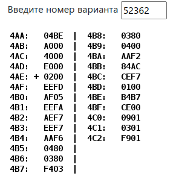

# Лабораторная работа №3 вар 52362
### По выданному преподавателем варианту восстановить текст заданного варианта программы, определить предназначение и составить описание программы, определить область представления и область допустимых значений исходных данных и результата, выполнить трассировку программы.

